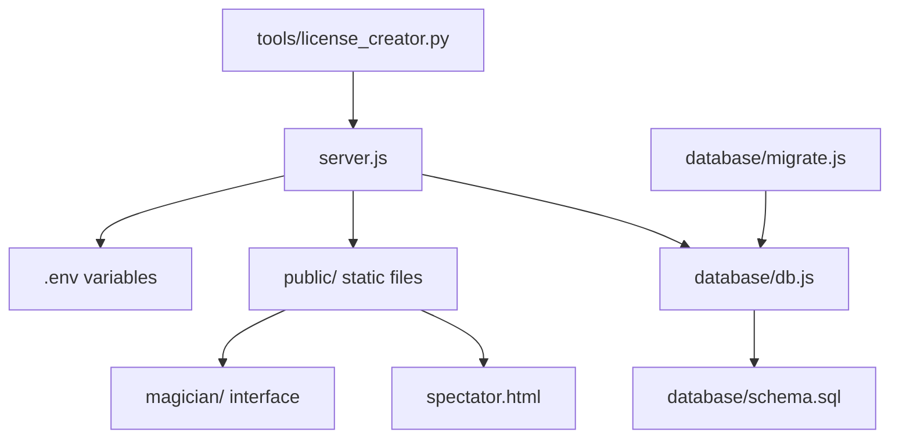

# 📁 Project Structure Documentation

## 🏗️ **Stopwatch Magic - Complete File Organization**

This document provides a comprehensive overview of the project structure, explaining the purpose and contents of every directory and important file.

```
📦 Stopwatch-webapp/
├── 📄 README.md                    # Main project documentation
├── 📄 CHANGELOG.md                 # Version history and changes  
├── 📄 PROJECT_STRUCTURE.md         # This file - project organization
├── 📄 PROJECT_OVERVIEW.md          # High-level project overview
├── 📄 DATABASE_GUIDE.md            # Database schema and migration guide
├── 📄 package.json                 # Project metadata and dependencies
├── 📄 package-lock.json            # Dependency version lock
├── 📄 .gitignore                   # Git ignore rules
├── 📄 .env                         # Environment variables (NOT in repo)
├── 📄 server.js                    # Main Express server application
│
├── 📁 public/                      # Static frontend files (PWA)
│   ├── 📄 index.html               # Redirect page to login
│   ├── 📄 spectator.html           # Main spectator stopwatch (beautiful UI)
│   ├── 📄 manifest.json            # PWA manifest for app installation
│   ├── 📄 sw.js                    # Service Worker for offline capability
│   ├── 🖼️ icon-192x192.png         # PWA icon (192x192)
│   ├── 🖼️ icon-512x512.png         # PWA icon (512x512)
│   │
│   ├── 📁 magician/                # Magician-specific interface
│   │   ├── 📄 login.html           # Registration and login page
│   │   ├── 📄 dashboard.html       # Magician control panel
│   │   └── 📄 stopwatch-admin.html # Magician stopwatch with force menu
│   │
│   ├── 📁 css/                     # Standalone stylesheets
│   │   └── 📄 styles.css           # Global styles (embedded in HTML)
│   │
│   └── 📁 js/                      # Standalone JavaScript files
│       ├── 📄 stopwatch.js         # Core stopwatch functionality
│       ├── 📄 shared.js            # Shared utilities
│       └── 📄 magician.js          # Magician-specific functions
│
├── 📁 database/                    # Database layer and migration
│   ├── 📄 schema.sql               # Complete database schema
│   ├── 📄 db.js                    # Database abstraction layer
│   ├── 📄 migrate.js               # Migration scripts (JSON → SQL)
│   ├── 📄 stopwatch_magic.db       # SQLite database file (NOT in repo)
│   └── 📁 backup/                  # Database backups (NOT in repo)
│
├── 📁 data/                        # Legacy JSON data files
│   ├── 📄 users.json               # Legacy user storage (migrated)
│   ├── 📄 licenses.json            # Legacy license storage (migrated)
│   ├── 📄 tokens.json              # Legacy token storage (migrated)
│   └── 📁 backup/                  # JSON file backups (NOT in repo)
│
├── 📁 tools/                       # Development and admin tools
│   └── 📄 license_creator.py       # Python script for license management
│
└── 📁 node_modules/                # npm dependencies (NOT in repo)
```

---

## 📋 **File Details and Purposes**

### 🌐 **Root Files**

| File | Purpose | Critical |
|------|---------|----------|
| `server.js` | Main Express application server | ⭐⭐⭐ |
| `package.json` | Project metadata, dependencies, scripts | ⭐⭐⭐ |
| `.env` | Environment variables (ADMIN_KEY, etc.) | ⭐⭐⭐ |
| `README.md` | Main project documentation | ⭐⭐ |
| `CHANGELOG.md` | Version history documentation | ⭐ |

### 📱 **Frontend (public/)**

#### **Core PWA Files**
- **`spectator.html`** - Main spectator stopwatch with beautiful iOS-like UI
- **`index.html`** - Redirect page that forwards to magician login
- **`manifest.json`** - PWA configuration for app installation
- **`sw.js`** - Service Worker for offline functionality and caching

#### **Magician Interface**
- **`magician/login.html`** - Registration and login interface
- **`magician/dashboard.html`** - Control panel showing tokens and API examples
- **`magician/stopwatch-admin.html`** - Magician stopwatch with local force testing

#### **Assets**
- **`icon-*.png`** - PWA icons for various screen sizes
- **`css/`** - Standalone stylesheets (mostly embedded in HTML now)
- **`js/`** - Standalone JavaScript modules (mostly embedded in HTML now)

### 🗄️ **Database Layer (database/)**

| File | Purpose | Description |
|------|---------|-------------|
| `schema.sql` | Database structure | Complete SQL schema with tables, indexes, triggers |
| `db.js` | Database abstraction | Node.js wrapper for all database operations |
| `migrate.js` | Migration tools | Scripts to migrate from JSON to SQL |
| `stopwatch_magic.db` | SQLite database | Actual database file (created automatically) |

### 🛠️ **Tools and Scripts (tools/)**

- **`license_creator.py`** - Python script for creating and managing license codes
  - Compatible with Pythonista iOS app
  - Direct API integration for admin operations
  - User-friendly interface for license management

### 💾 **Data Files (data/)**

Legacy JSON storage files (now migrated to SQL):
- `users.json` - User accounts and authentication data
- `licenses.json` - License codes and usage tracking  
- `tokens.json` - API tokens and force queues

---

## 🔧 **Critical Configuration Files**

### **Environment Variables (.env)**
```bash
# REQUIRED for production
ADMIN_KEY=your-secret-admin-key-here
NODE_ENV=production

# OPTIONAL
PORT=3000  # Render sets automatically
```

### **Database Configuration**
- **Development**: SQLite (`database/stopwatch_magic.db`)
- **Production**: SQLite (auto-created on Render)
- **Migration**: Automatic from JSON files on first run

---

## 🚀 **Deployment Structure**

### **Render.com Production**
```
/opt/render/project/src/
├── server.js                 # Main application
├── package.json              # Dependencies
├── database/
│   ├── stopwatch_magic.db    # Auto-created
│   └── schema.sql            # Structure
├── public/                   # Static files served by Express
└── node_modules/             # Auto-installed
```

### **Environment Setup**
- **Development**: Local `.env` file
- **Production**: Render environment variables
- **Database**: Auto-initialization on startup

---

## 📊 **File Size Overview**

| Category | Files | Total Size | Description |
|----------|-------|------------|-------------|
| **Frontend** | 15+ | ~100KB | HTML, CSS, JS, Icons |
| **Backend** | 5 | ~25KB | Server, Database, Config |
| **Documentation** | 6 | ~50KB | README, Guides, Structure |
| **Tools** | 2 | ~5KB | Python scripts, utilities |
| **Dependencies** | ~500 | ~15MB | node_modules (not in repo) |

---

## 🔐 **Security-Sensitive Files**

| File/Folder | Security Level | Reason |
|-------------|----------------|---------|
| `.env` | 🔴 CRITICAL | Contains ADMIN_KEY |
| `database/` | 🟠 HIGH | User data and passwords |
| `tools/license_creator.py` | 🟡 MEDIUM | Contains API keys |
| `data/backup/` | 🟡 MEDIUM | Historical user data |

---

## 🛣️ **File Flow and Dependencies**



---

## 📱 **PWA File Structure**

Essential files for Progressive Web App functionality:

```
public/
├── manifest.json           # App metadata and icons
├── sw.js                   # Service Worker for offline
├── icon-*.png             # App icons for installation
├── spectator.html          # Main app interface
└── magician/               # Admin interface
    ├── login.html
    ├── dashboard.html
    └── stopwatch-admin.html
```

---

## 🔄 **Development Workflow**

### **Local Development**
1. `npm install` - Install dependencies
2. `npm run db:migrate` - Setup database
3. `npm start` - Start server
4. Edit files in `public/` or `server.js`

### **Deployment**
1. `git add .` - Stage changes
2. `git commit -m "message"` - Commit changes
3. `git push origin main` - Deploy to Render

### **Database Operations**
1. `npm run db:backup` - Create backup
2. `npm run db:test` - Test connection
3. `npm run db:migrate` - Run migration

---

## 📚 **Related Documentation**

- **[README.md](README.md)** - Main project documentation
- **[DATABASE_GUIDE.md](DATABASE_GUIDE.md)** - Database schema and operations
- **[PROJECT_OVERVIEW.md](PROJECT_OVERVIEW.md)** - High-level project overview
- **[CHANGELOG.md](CHANGELOG.md)** - Version history and changes

---

## 🤝 **Contributing Guidelines**

When adding new files:
1. **Follow naming conventions** (kebab-case for files)
2. **Update this documentation** with new additions
3. **Add to .gitignore** if sensitive or generated
4. **Include in appropriate backup** strategies

---

**📁 This structure is designed for scalability, security, and maintainability.** ✨